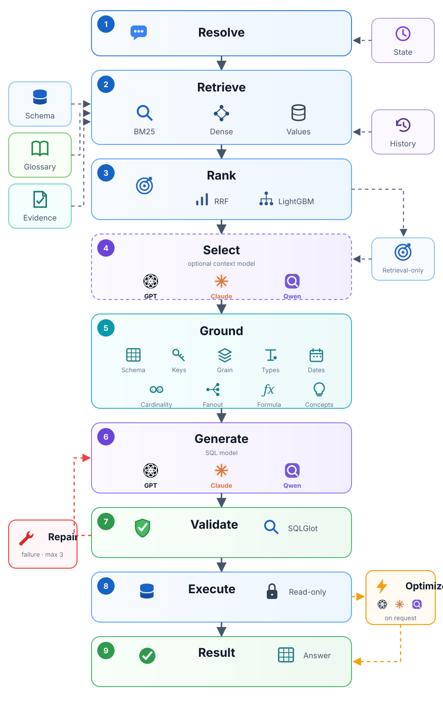

# Semantic Text-to-SQL — Ideal A/B Version

A local-first Text-to-SQL application for measuring the incremental effect of a bounded
Model 1 context selector. Both experimental arms share hybrid retrieval, ML reranking, deterministic
grounding, the SQL model, validation, and execution.

<p align="center">
  
</p>

## Current architecture

```text
User question
    |
    v
Conversation resolver
    |
    v
BM25 + dense embeddings + profiled value matching
    |  RRF fusion + optional LightGBM column reranking
    |  PK/FK and bridge restoration
    v
Shared high-recall candidate context
    |
    +-- mode=model1 --> bounded Model 1 context selector --+
    |                                                    |
    +-- mode=retrieval ----------------------------------+
                                                         |
    v
Deterministic grounding
    |  keys, grain, relationships, types, NULL presence,
    |  text examples, mandatory selected-date formats
    v
Model 2: SQL-only generator
    |
    v
SQLGlot syntax and read-only safety validation
    |
    v
Read-only execution
    |
    +-- failure --> focused SQL repair, maximum 3 attempts
    |
    v
Final SQL, result, context JSON, and attempt history
```

The web application has a **Context method** selector and a separate **SQL generator** selector.
Choose `Hybrid retrieval only` to bypass Model 1, or choose any configured model to use it for
context selection. The SQL generator is selected independently.

During each request, the interface displays live progress across conversation resolution, schema
retrieval, optional context selection, deterministic grounding, and SQL generation/validation/
execution. Completed responses separate SQL safety, execution success, and unmeasured semantic
correctness. The verified context is rendered as readable table, column, key, type, date-format, and
relationship cards, with the exact raw JSON still available on demand.

Token accounting reports total provider usage, conversation-resolution usage, context-model usage,
SQL-attempt usage, every individual attempt, cache usage, estimated model-context size, and tokens
avoided through pruning. Tokens consumed by discarded SQL attempts are identified as measurable
retry waste. Missing provider usage is displayed as unavailable and is never converted to zero.

## Model responsibilities

### Shared hybrid retrieval

Both arms use the same three independent retrieval signals:

- BM25 over table/column names, descriptions, aliases, glossary terms, and profile metadata
- Local dense embeddings using `BAAI/bge-small-en-v1.5`
- Value matching against profiled database values

Reciprocal Rank Fusion combines their ranks. The bundled 11-feature LightGBM model reranks columns
using those signals, key roles, and leakage-safe historical schema evidence. RRF retains ownership
of table ranking. Deterministic code restores PKs, FKs, formula dependencies, and bridge tables.

### Model 1: context selector

Model 1 receives the resolved question, optional trusted evidence, a high-recall candidate schema,
compact relationship topology, directly relevant glossary entries, and minimal previous context for
follow-ups.

It returns JSON containing only:

```json
{
  "selected_tables": ["customers"],
  "selected_columns": {
    "customers": ["CustomerID", "Currency"]
  },
  "business_concepts": [],
  "metadata_requests": []
}
```

Model 1 must not generate SQL or decide aggregation, grouping, ranking, joins, CTEs, `DISTINCT`, or
another SQL implementation strategy. If no supplied glossary concept directly matches the
question, `business_concepts` must be empty.

### Deterministic grounding

After Model 1 selection—or directly after retrieval when Model 1 is bypassed—deterministic code
verifies identifiers and adds required database facts:

- Table primary keys, unique keys, relationship keys, and row grain
- Relationship path, cardinality, key uniqueness, and fanout risk for selected tables
- Physical database type for every selected column
- `observed_nulls`: whether profiling found any SQL `NULL`
- Up to five safe `example_values` for selected text/categorical columns
- Mandatory physical `format` for every selected date/datetime column
- Directly matched, approved business definitions when Model 1 selected them

Example Model 2 context:

```json
{
  "question": "How many records are in each category?",
  "dialect": "sqlite",
  "tables": {
    "items": {
      "grain": "one row per ItemID",
      "primary_key": ["ItemID"],
      "unique_keys": [["ItemID"]],
      "columns": {
        "ItemID": {
          "type": "INTEGER",
          "observed_nulls": false
        },
        "Category": {
          "type": "TEXT",
          "observed_nulls": false,
          "example_values": ["Books", "Music"]
        }
      }
    }
  }
}
```

The web interface exposes this object under **Verified context sent to Model 2**.

### Model 2: SQL generator

Model 2 receives the question, dialect, selected live schema, verified context, optional trusted
evidence, and focused repair information after a failure. It generates correctness-first efficient
SQL: only required projections, early semantics-preserving filters, no unnecessary joins/CTEs/
`DISTINCT`/repeated scans, `EXISTS` for filter-only relationships when appropriate, and safe
pre-aggregation when a many-side join would multiply measures. These preferences never override
the required outputs, filters, formulas, grain, ordering, or result semantics. It returns one SQL
statement only:

```sql
SELECT COUNT(*) AS customer_count
FROM customers;
```

It does not return a semantic-plan JSON object, Markdown, commentary, or multiple alternatives.

## Spider Model 1 A/B benchmark

The benchmark runner uses the same fixed Spider 1.0 dev indices, provider/model, profiles, hybrid
retriever, ML artifact, Model 2 prompt, attempt limit, read-only execution, and result-equivalence
scoring for both arms. The only experimental variable is `context_mode`.

Verified preliminary result on 20 executable Spider dev questions (seed 42, AgentRouter
`gpt-5.6-sol`):

| Mode | Correct | Execution accuracy | Mean latency |
|---|---:|---:|---:|
| Hybrid retrieval without Model 1 | 17/20 | 85% | 6.9 s |
| Hybrid retrieval plus Model 1 | 17/20 | 85% | 11.5 s |

Paired outcomes were 16 both correct, one retrieval-only, one Model-1-only, and two neither. On this
small sample Model 1 did not improve aggregate accuracy and increased mean latency by about 67%.
This is a preliminary directional result, not a statistically conclusive Spider score. AgentRouter
did not return token accounting, so token impact is unmeasured rather than reported as zero.

Run a larger paired comparison:

```bash
uv sync --extra ml
uv run python benchmarks/compare_model1_spider.py \
  --spider-root benchmarks/spider_data/spider_data \
  --profile-root profiles/spider \
  --provider agentrouter \
  --model gpt-5.6-sol \
  --count 100
```

The runner checkpoints after every paired question and reports result-set execution equivalence,
paired wins, context size, latency, attempts, and provider token usage when available.

## Validation boundary

The active generation path deliberately keeps only high-confidence validation:

- SQL parses with SQLGlot
- Exactly one statement
- `SELECT` or `WITH ... SELECT` only
- No `INSERT`, `UPDATE`, `DELETE`, DDL, administrative commands, or `SELECT INTO`
- Execution uses a read-only connection/transaction

The runtime does **not** reject SQL using exact formula strings, exact aggregation structures,
specific join/CTE strategies, grain/cardinality AST patterns, or glossary formula matching.

Statuses have narrow meanings:

- `SQL_SAFETY_VALID`: syntax and read-only safety checks passed
- `ACCEPTED`: read-only execution also succeeded

Neither status proves business correctness. Returning rows—or returning a non-empty result—is never
treated as proof that the query correctly answers the question.

When an attempt fails, the web application displays its attempt number, error code, explanation,
and rejected SQL. Parse and database failures receive focused repair feedback. Generation
is bounded to three total SQL attempts.

## Models

The current model catalog exposes:

- Local Ollama: `qwen3.5:9b`
- AgentRouter: `gpt-5.6-sol`
- AgentRouter: `claude-opus-5`
- AgentRouter: `claude-opus-4-7`
- Groq: `qwen/qwen3.6-27b`

The model endpoint reports whether each option is currently configured. AgentRouter credentials
and Groq credentials remain server-side and are never sent to the browser. The web application lets
the user select the context model and SQL generator independently. Server-side SQL-model overrides
remain available for controlled deployments.

## Install

Requirements:

- Python 3.12+
- [uv](https://docs.astral.sh/uv/)
- Ollama when using the local model

```bash
cd semantic_text2sql_ideal
uv sync --dev --extra ml
cp .env.example .env
```

For local generation:

```bash
ollama pull qwen3.5:9b
ollama serve
```

For AgentRouter, put the token in the ignored `.env` file:

```dotenv
AGENTROUTER_API_KEY=your-token-here
AGENTROUTER_BASE_URL=https://agentrouter.org
```

For Qwen 3.6 27B on Groq:

```dotenv
GROQ_API_KEY=your-groq-key-here
GROQ_BASE_URL=https://api.groq.com/openai/v1
```

Never commit `.env`; it is ignored by Git.

## Database layout

SQLite databases are discovered under `TEXT2SQL_DATABASE_ROOT`. Each database uses this layout:

```text
data/
  books/
    books.sqlite
```

For BIRD databases, point the root to the directory containing database-ID folders:

```dotenv
TEXT2SQL_DATABASE_ROOT=../bird-bench/llm/mini_dev_data/minidev/MINIDEV/dev_databases
TEXT2SQL_PROFILE_ROOT=profiles
TEXT2SQL_GLOSSARY_ROOT=data/business_glossaries
```

Profiles are generated offline:

```bash
uv run python scripts/profile_database.py \
  --dialect sqlite \
  --db-id books \
  --output profiles
```

Historical examples are disabled by default. The implementation remains available behind
`TEXT2SQL_HISTORY_ENABLED=false`; enable it only after a paired evaluation demonstrates benefit.
The bundled BIRD seed and evaluation tools live under `benchmarks/` and are not part of the runtime
pipeline.

## Run

```bash
set -a
source .env
set +a
uv run uvicorn semantic_text2sql.api:app --host 127.0.0.1 --port 8000
```

Open <http://127.0.0.1:8000>.

Health check:

```bash
curl http://127.0.0.1:8000/api/health
```

Expected response:

```json
{"status":"online"}
```

## API

- `POST /api/chat/jobs`: start a cancellable conversational query
- `GET /api/chat/jobs/{job_id}`: inspect progress or retrieve the response
- `DELETE /api/chat/jobs/{job_id}`: cancel an active request
- `POST /api/chat`: synchronous conversation endpoint
- `POST /api/check`: check and optionally execute supplied read-only SQL
- `GET /api/health`: health status
- `GET /api/models`: configured model discovery
- `GET /api/databases`: configured database discovery

Example synchronous request:

```bash
curl -X POST http://127.0.0.1:8000/api/chat \
  -H 'Content-Type: application/json' \
  -d '{
    "session_id": "demo-1",
    "db_id": "books",
    "message": "How many books are there in each category?",
    "provider": "ollama",
    "model": "qwen3.5:9b"
  }'
```

Conversation state is process-local. Failed turns preserve the last accepted state. The web UI
supports follow-ups, corrections, explanation, optimization, cancellation, SQL copying, result
tables, token usage, exact Model 2 context, and validation-attempt inspection.

## Configuration

Important environment variables:

| Variable | Purpose | Default |
|---|---|---|
| `TEXT2SQL_DATABASE_ROOT` | SQLite database root | `data` |
| `TEXT2SQL_PROFILE_ROOT` | Offline profile root | `profiles` |
| `TEXT2SQL_GLOSSARY_ROOT` | Approved glossary root | `data/business_glossaries` |
| `OLLAMA_BASE_URL` | Ollama endpoint | `http://127.0.0.1:11434` |
| `AGENTROUTER_API_KEY` | AgentRouter token | unset |
| `AGENTROUTER_BASE_URL` | AgentRouter gateway | `https://agentrouter.org` |
| `GROQ_API_KEY` | Groq API token | unset |
| `GROQ_BASE_URL` | Groq OpenAI-compatible endpoint | `https://api.groq.com/openai/v1` |
| `TEXT2SQL_EMBEDDING_MODEL` | Local dense retrieval model | `BAAI/bge-small-en-v1.5` |
| `TEXT2SQL_RETRIEVAL_TABLES` | Shared high-recall table budget | `5` |
| `TEXT2SQL_RETRIEVAL_COLUMNS` | Approximate column budget per table | `5` |
| `TEXT2SQL_SCHEMA_RERANKER_ENABLED` | Enable LightGBM column reranking | `true` |
| `TEXT2SQL_SCHEMA_RERANKER_MODEL` | Versioned LightGBM artifact | `models/schema_reranker/v1/model.txt` |
| `TEXT2SQL_CONTEXT_MODEL` | Optional Model 1 override | selected model |
| `TEXT2SQL_SQL_MODEL` | Optional Model 2 override | selected model |
| `TEXT2SQL_HISTORY_ENABLED` | Enable historical examples | `false` |
| `TEXT2SQL_HISTORY_MIN_SCORE` | Minimum historical score | `0.85` |
| `TEXT2SQL_HISTORY_ML_MIN_SCORE` | Minimum history score for ML schema evidence | `0.65` |

## Verification

```bash
uv run ruff format --check src
uv run ruff check src
uv run mypy src/semantic_text2sql
```

Do not compare these numbers with old v3/v4/v5 runs unless the question indices, database files,
provider/model, prompt, execution limits, and result-equivalence rules are identical.

## Security notes

- `.env`, virtual environments, generated profiles, and local runtime files are ignored by Git.
- API keys remain server-side.
- SQL is parsed and restricted to one read-only query before execution.
- SQLite uses query-only connections; PostgreSQL uses read-only transactions.
- Rows and retry attempts are bounded.
- The bundled `books.sqlite` is demonstration data, not a production database.

## Project layout

```text
src/semantic_text2sql/
  api.py              FastAPI and web endpoints
  conversation.py     turn classification and session state
  context_planner.py  Model 1 bounded context selection
  context.py          deterministic context assembly
  hybrid_retrieval.py BM25, dense, value matching, RRF, ML reranking, bridge expansion
  linker.py           deterministic fallback schema selection
  profiling.py        offline database profiles
  glossary.py         direct-match glossary retrieval
  llm.py              Ollama, AgentRouter, and Groq adapters plus Model 2 prompt
  validator.py        SQLGlot syntax and read-only safety checks
  agent.py            bounded repair and read-only execution
web/
  index.html
  app.js
  styles.css
scripts/
  train_schema_reranker.py
benchmarks/
  compare_model1_spider.py
  create_demo_db.py
  profile_database.py
benchmarks/
  evaluate_bird.py
  build_bird_history.py
  run_chat_queue.py
  data/bird_history_seed42_400.json
```
